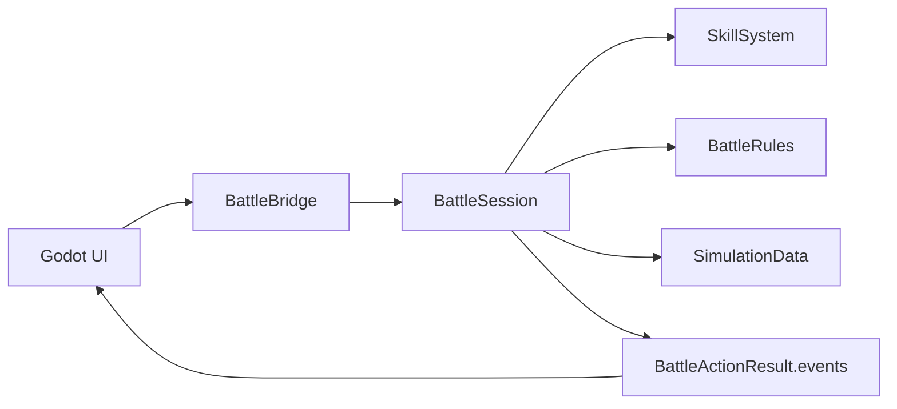
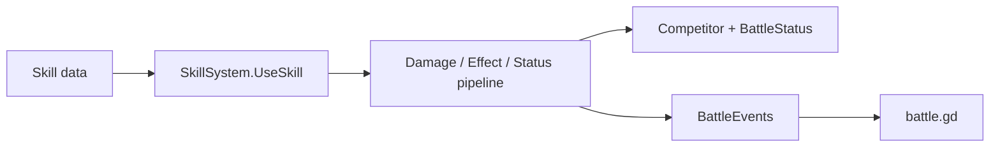
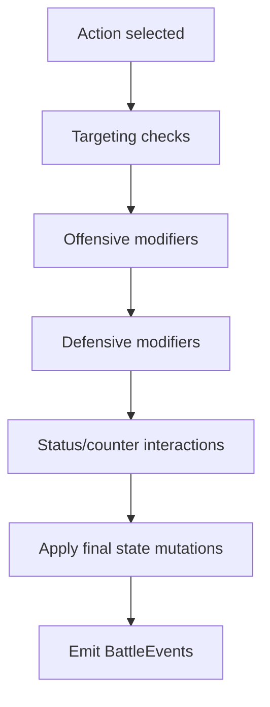
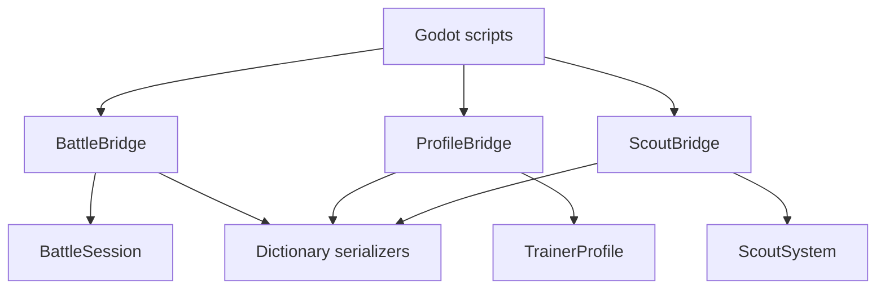
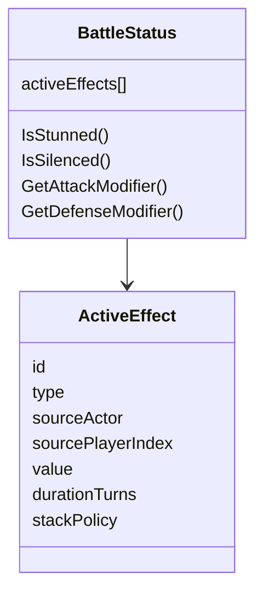
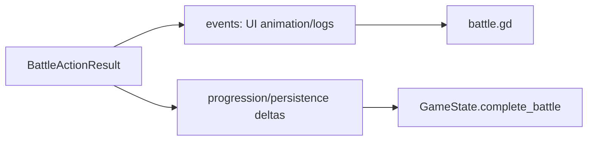

# Refactor Plan - 9 June

This plan captures the main scalability and maintainability issues in the current battle/gameplay architecture. The current design is healthy for a prototype: Godot owns input and presentation, C++ owns combat, and `BattleActionResult.events` is the bridge contract. The goal of these refactors is to preserve that shape while making the system easier to grow.

## Current Architecture Summary



- `battle.gd` handles player input, buttons, animation, logs, and state display.
- `BattleBridge` translates between Godot `Dictionary` / `Array` values and C++ structs.
- `BattleSession` owns one battle, validates actions, mutates battle state, resolves turn flow, and returns structured results.
- `SkillSystem` applies skill usage, damage, secondary effects, mana changes, and skill XP.
- `BattleRules` owns formulas such as mana cost, cooldown, accuracy, effect value, and damage.
- `SimulationData` currently owns hardcoded skill/spec/trait definitions.

## Skill System North Star

The useful long-term model is:

```text
Skill = data packet.
Combat engine = pipeline that interprets the packet.
Statuses/passives = modifiers or hooks that affect the pipeline.
Battle state = source of truth.
UI = presentation of events and results.
```

This matches the current design, but pushes it toward more composition:



The goal is not to make a unique class or function for every skill. A skill should eventually be a container of simple effect definitions, such as:

```json
{
  "id": "shield_bash",
  "name": "Shield Bash",
  "cooldown": 3,
  "effects": [
    { "type": "damage", "value": 15, "target": "enemy" },
    { "type": "apply_status", "status_id": "stunned", "duration": 2, "target": "enemy" }
  ]
}
```

That means the skill does not know how stun works. It only applies a stun effect. The turn/action systems know what stun means when they validate actions, tick durations, and resolve turn flow.

For future counters and interactions, think in pipeline stages:



Examples:

- Taunt or cover can modify target selection.
- Wet can reduce fire damage and remove itself.
- Shield can intercept or reduce incoming damage.
- Silence can reject non-basic skills during action validation.
- Stun can prevent action during turn/action validation.

Avoid jumping straight to a fully generic interceptor framework. Build these stages only as mechanics demand them. The next useful step is composable effects, not a total rules-engine rewrite.

## Main Risks

### 1. `BattleBridge` Is Becoming Too Large

`native/BattleBridge.cpp` currently handles too many responsibilities:

- Battle calls.
- Profile conversion.
- Scout offers.
- Trainer battle completion.
- State serialization.
- Event serialization.
- Reward and progression application.
- Enum and error string conversion.

This is fine for the current scope, but it will become difficult to change safely as features grow.

Recommended direction:

- Keep `BattleBridge` focused on battle lifecycle calls.
- Extract profile/trainer operations into a separate bridge or service.
- Extract scout operations into a separate bridge or service.
- Move repeated dictionary serialization into dedicated serializer helpers.

Possible future shape:



### 2. Skill And Status Effects Are Hardcoded

`SkillSystem.cpp` and `Models.h` currently model statuses with dedicated fields such as:

- `stunnedTurns`
- `silencedTurns`
- `attackModifierPercent`
- `defenseModifierPercent`
- `markTurns`
- `markBonusDamage`

This is readable now, but it will become awkward when adding many effects, stacking rules, cleanses, dispels, passive triggers, items, or skills with multiple effects.

Recommended direction:

- Keep the current model while the status list is small.
- Allow one skill to contain multiple effects before building a fully generic effect engine.
- When effect count grows, introduce a generic active-effect container.
- Model active effects as data: id, type, source, target, value, duration, stack behavior.
- Keep convenience accessors for common checks such as `IsStunned()` and `CanCastNonBasicSkill()`.

Possible future shape:



### 3. Combat Data Is Hardcoded In C++

Skills are currently defined in `SimulationData.cpp`. This is fast and type-safe, but not friendly for content iteration.

Recommended direction:

- Move skills, specs, traits, and drills into data files or Godot resources.
- Load those definitions into the existing C++ structs.
- Validate loaded data at startup so bad content fails loudly.

Candidate formats:

- JSON for structured data and simple tooling.
- CSV for spreadsheet-driven tuning.
- Godot `Resource` files if designers will edit primarily in Godot.

Short-term compromise:

- Keep C++ defaults.
- Add optional external data loading later.
- Tests should verify all skill IDs referenced by specs exist.

### 4. Events Are Doing Too Much Work

The event stream is a good UI/log/audit contract. It is less ideal as the only way to infer persistent progression changes after combat.

Recommended direction:

- Keep `BattleActionResult.events` for presentation.
- Add explicit result fields for persistence, such as:
  - `progression_changes`
  - `roster_changes`
  - `rating_change`
  - `money_reward`
  - `battle_xp_awards`
- Let the UI animate events, but let persistence consume explicit deltas.

Possible future shape:



### 5. Minor Performance Pressure Points

No urgent performance issue exists for a turn-based prototype. Current battle sizes are small, and most heavy work is in C++.

Potential future issues:

- Full state serialization through Godot `Dictionary` / `Array` on every action.
- Linear skill and cooldown lookups if ability counts grow.
- Rebuilding skill buttons every refresh in `battle.gd`.

Recommended direction:

- Leave these alone until scale demands it.
- If needed later, replace repeated vector scans with maps or indexed handles.
- Pool/reuse UI buttons only if refreshes become visibly expensive.
- Avoid optimizing bridge serialization until there are many entities or frequent simulations.

## Concrete Cleanup Items

These are smaller, high-confidence refactors that should reduce confusion and make the project easier to maintain.

### Remove Or Repurpose Manual Switch UI

The battle core currently uses automatic party turn advancement through `BattleSession::AdvanceToNextPlayer`. Manual switching is rejected by `BattleSession::SwitchPlayer` with `"The party order is fixed during battle."`

The Godot battle script still contains manual switch UI code:

- `player_list_button`
- `_show_player_list_menu`
- `_refresh_team_switches`
- `_on_switch_pressed`
- switch labels/grid visibility logic

Recommended direction:

- Remove the manual switch action from the battle UI if switching is not part of the rules.
- Keep or repurpose the lineup display as read-only turn/party information.
- Keep `BattleSession::SwitchPlayer` only if it is useful as a defensive API boundary; otherwise remove bridge/UI callers first.

### Move Procedural Battle UI Into `battle.tscn`

`battle.gd` currently creates some UI nodes procedurally, including the lineup panel and target controls. This was useful for prototyping, but it fights Godot's scene workflow.

Recommended direction:

- Move the lineup panel, target label, and target grid into `battle.tscn`.
- Reference them with `@onready` variables.
- Let GDScript update data, visibility, styles, and button contents.
- Keep layout, anchors, sizing, and node hierarchy in the scene editor.

This keeps UI layout easier to inspect, theme, and adjust without reading script code.

### Add Bridge Extraction Helpers

`BattleBridge.cpp` repeatedly converts Godot strings to `std::string` with patterns like:

```cpp
std::string(String(value).utf8().get_data())
```

This is currently safe when copied immediately, but it is verbose and easy to misuse if a future edit stores the raw `get_data()` pointer.

Recommended direction:

- Add small local helpers for common extraction patterns.
- Use helpers for strings, ints with defaults, bools with defaults, and arrays when useful.
- Keep helpers near bridge serialization/deserialization code or in a dedicated bridge utility file if the bridge is split.

Example shape:

```cpp
std::string GetStringField(const Dictionary& dictionary, const String& key, const std::string& fallback = "")
{
    if (!dictionary.has(key))
    {
        return fallback;
    }

    return std::string(String(dictionary[key]).utf8().get_data());
}
```

### Add GDScript Types Gradually

Some Godot state variables are still untyped, such as `var roster: Array = []`. Godot 4 typed arrays can improve autocomplete and catch mistakes earlier.

Recommended direction:

- Convert obvious homogeneous arrays to typed arrays, such as `Array[Dictionary]`.
- Avoid forcing types where data is intentionally mixed or Godot complains about Variant conversions.
- Treat this as gradual cleanup alongside normal UI/state work, not a standalone migration.

## Suggested Refactor Order

1. Split `BattleBridge.cpp` by responsibility.
2. Add serializer helpers for battle state, battle result, events, profile data, and errors.
3. Add explicit progression/persistence deltas to battle completion results.
4. Move combat definitions out of `SimulationData.cpp` into loadable data.
5. Let a skill contain multiple effect definitions.
6. Introduce a generic status/effect container once effect complexity grows.
7. Add pipeline/interceptor stages only for concrete mechanics such as taunt, cover, shields, cleanses, elemental counters, or reflect.
8. Optimize lookup and UI refresh paths only after profiling shows a real problem.

## Non-Goals For Now

- Do not rewrite `BattleSession`; it is a good central owner for battle flow.
- Do not optimize dictionary serialization prematurely.
- Do not replace the event stream; it is useful and should remain the UI contract.
- Do not build a generic effect engine until content complexity justifies it.
- Do not create one class per skill or one function per skill.

## Guiding Principle

Preserve the current good separation:

```text
Godot UI handles presentation.
BattleBridge translates.
BattleSession owns battle state and turn flow.
SkillSystem applies skill behavior.
BattleRules owns formulas.
SimulationData/data files define content.
```

The refactors should make those boundaries clearer, not blur them.
